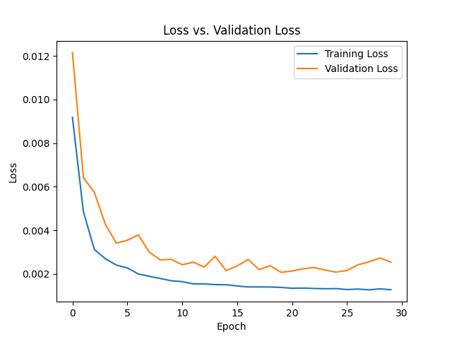

# Traffic-Prediction-Using-LSTM

This project aims to predict traffic volume on junctions of highways using historical data. Accurate traffic prediction is crucial for traffic management, route planning, and reducing congestion.

## Dataset

This dataset contains 48.1k (48120) observations of the number of vehicles each hour in four different junctions:
1) DateTime
2) Juction
3) Vehicles
4) ID
The sensors on each of these junctions were collecting data at different times, hence you will see traffic data from different time periods.

## Methodology

I used Long Short-Term Memory (LSTM) networks, a type of recurrent neural network well-suited for time series data forecasting. Each junctions are separately analyzed.

## Results

The LSTM model achieved very low Root Mean Squared Error (RMSE), demonstrating reasonable accuracy.

